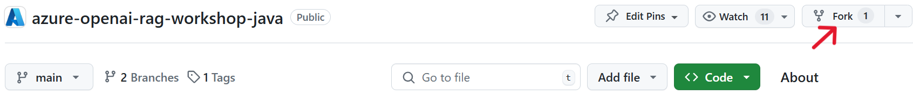
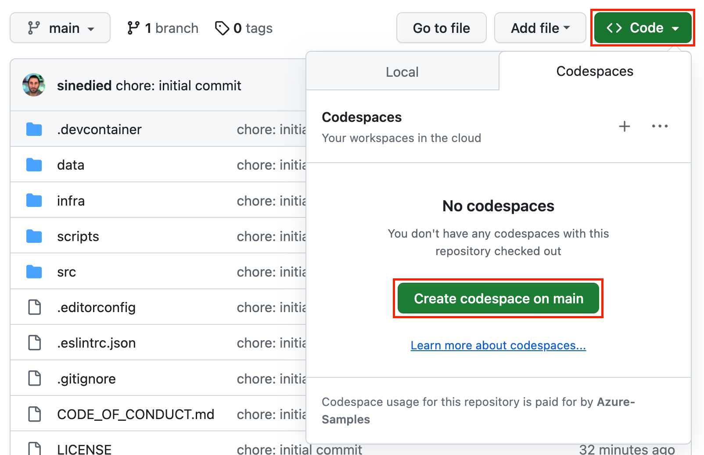
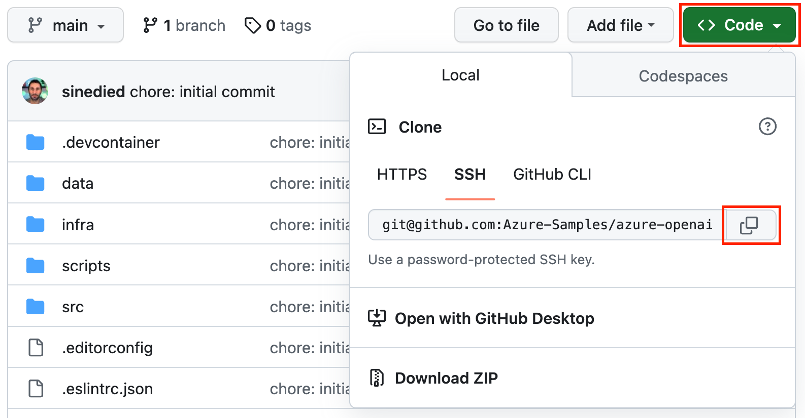
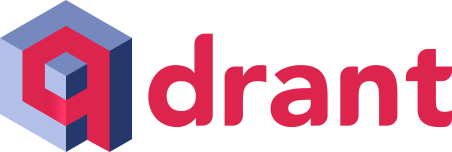
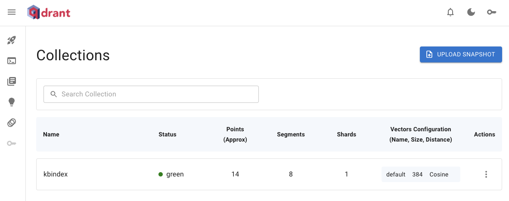
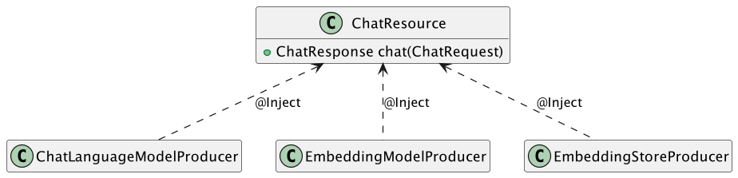
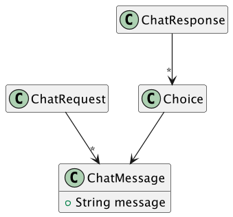
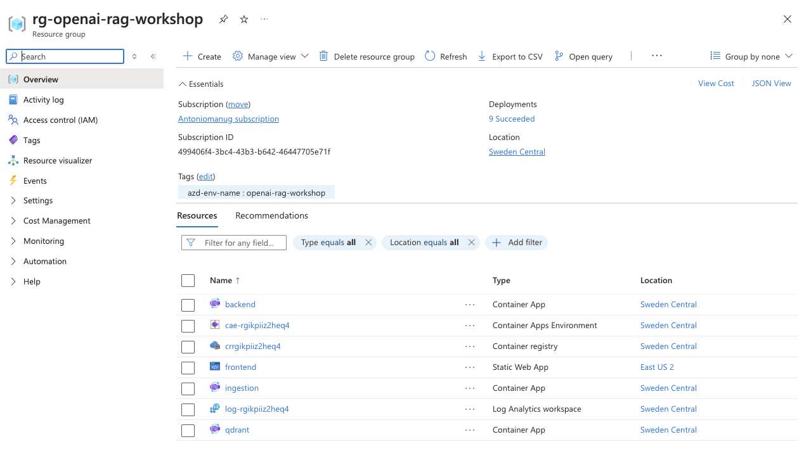
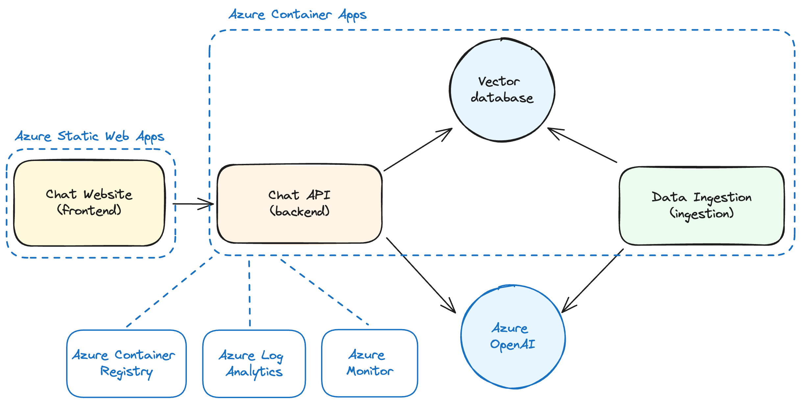
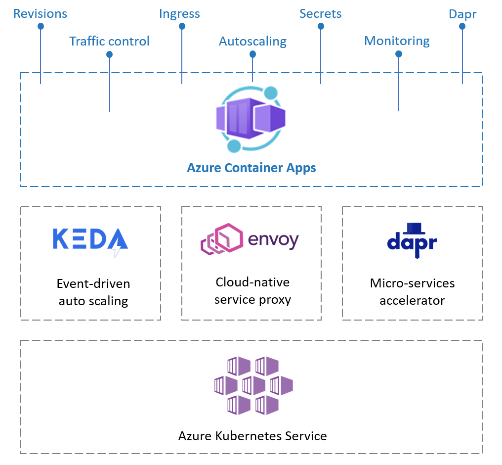

# Create your own ChatGPT with Retrieval-Augmented-Generation

In this workshop, we'll explore the fundamentals of custom ChatGPT experiences based on a corpus of documents. We will create a vector database and fill-in with data from PDF documents, and then build a chat website and API to be able to ask questions about information contained in these documents. 

## You'll learn how to...

- Create a knowledge base using a vector database.
- Ingest documents in a vector database.
- Create a Web API with [Quarkus](https://quarkus.io/).
- Use [Azure OpenAI](https://azure.microsoft.com/products/ai-services/openai-service) models and [LangChain4j](https://langchain4j.github.io/langchain4j/) to generate answers based on a prompt.
- Query a vector database and augment a prompt to generate responses.
- Connect your Web API to a ChatGPT-like website.
- (optionally) Deploy your application to Azure.

## Prerequisites

<div data-hidden="$$proxy$$">

|                   |                                                                      |
|-------------------|----------------------------------------------------------------------|
| GitHub account    | [Get a free GitHub account](https://github.com/join)                 |
| Azure account        | [Get a free Azure account](https://azure.microsoft.com/free) |
| Access to Azure OpenAI API | [Request access to Azure OpenAI](https://aka.ms/oaiapply) |
| A Web browser     | [Get Microsoft Edge](https://www.microsoft.com/edge)                 |
| An HTTP client    | [For example curl](https://curl.se/)                                 |
| Java knowledge    | [Java tutorial on W3schools](https://www.w3schools.com/java/)        |
| Quarkus knowledge | [Quarkus Getting Started](https://quarkus.io/guides/getting-started) |

</div>

<div data-visible="$$proxy$$">

|                   |                                                                      |
|-------------------|----------------------------------------------------------------------|
| GitHub account    | [Get a free GitHub account](https://github.com/join)                 |
| A Web browser     | [Get Microsoft Edge](https://www.microsoft.com/edge)                 |
| An HTTP client    | [For example curl](https://curl.se/)                                 |
| Java knowledge    | [Java tutorial on W3schools](https://www.w3schools.com/java/)        |
| Quarkus knowledge | [Quarkus Getting Started](https://quarkus.io/guides/getting-started) |

</div>

We'll use [GitHub Codespaces](https://github.com/features/codespaces) to have an instant dev environment already prepared for this workshop.

If you prefer to work locally, we'll also provide instructions to setup a local dev environment using either VS Code with a [dev container](https://aka.ms/vscode/ext/devcontainer) or a manual install of the needed tools with your favourite IDE (Intellij IDEA, VS Code, etc.).

<div class="info" data-title="note" data-hidden="$$proxy$$">

> Your Azure account must have `Microsoft.Authorization/roleAssignments/write` permissions, such as [Role Based Access Control Administrator](https://learn.microsoft.com/azure/role-based-access-control/built-in-roles#role-based-access-control-administrator-preview), [User Access Administrator](https://learn.microsoft.com/azure/role-based-access-control/built-in-roles#user-access-administrator), or [Owner](https://learn.microsoft.com/azure/role-based-access-control/built-in-roles#owner). Your account also needs `Microsoft.Resources/deployments/write` permissions at a subscription level to allow deployment of Azure resources.
>
> If you have your own personal Azure subscription, you should be good to go. If you're using an Azure subscription provided by your company, you may need to contact your IT department to ensure you have the necessary permissions.

</div>

---

## Introduction

Organizations of all sizes have amassed a plethora of documents over time. While generative AI, such as ChatGPT, can provide answers about general knowledge and historical events with reasonable accuracy, they can also be tailored to answer questions based on a company's internal documents.

<div class="info" data-title="note">

> **Accuracy in Generative AI** 
> Large Language Models (LLMs), like the ones powering ChatGPT, aren't designed for high-precision answers. They may produce "hallucinations", offering responses that seem authoritative but are actually incorrect. It's crucial to **inform users that the responses are AI-generated**. In this workshop, we'll explore how to generate answers that link to their information sources — this is what we call *grounding* — enabling users to verify the accuracy of the AI's responses.

</div>

In this workshop, we'll guide you through building a chat application that generates responses based on your documents and deploy it to Azure. We'll touch on many different topics, but we'll take it one step at a time.

### Application architecture

Below is the architecture of the application we're going to build:


Our application consists of five main components:

1. **Vector Database**: The vector database stores mathematical representations of our documents, known as _embeddings_. These are used by the Chat API to find documents relevant to a user's question.

2. **Ingestion Service**: The ingestion service feeds data from your documents into this vector database.

3. **Chat API**: This API enables a client application to send chat messages and receive answers generated from the documents in the vector database.

4. **Chat Website**: This site offers a ChatGPT-like interface for users to ask questions and receive answers about the ingested documents.

5. **OpenAI Model Deployment**: We will use the `gpt-3.5-turbo` model, hosted on Azure, for this workshop. The code can also be adapted to work with OpenAI's APIs or Ollame with minimal changes.

### What is Retrievial-Augmented Generation?

Retrieval-Augmented generation (RAG) is a powerful technique that combines the strengths of two different approaches in natural language processing: retrieval-based methods and generative models. This hybrid approach allows for the generation of responses that are both contextually relevant and rich in content. Let's break down how this works in the context of creating a custom ChatGPT-like model.

At its core, RAG involves two main components:

- **Retriever**: Think "_like a search engine_", finding relevant information from a database. The retriever usually searches in a vector database. It could also - for some use cases - search on application dabases, APIs and other sources of information. In this workshop, we will implement this logic in the _Chat API_.

- **Generator**: Acts like a writer, taking the prompt and information retrieved to craft a response. In this workshop, OpenAI `gpt-3.5-turbo` will be our generator.


The RAG process involves the following steps:

1. **Embedding Computation**: Converts a user's prompt into an embedding for similarity comparisons.

2. **Document Retrieval**: Finds the most relevant documents using the prompt's embedding. This is where systems like Azure AI Search come into play, allowing for efficient vector similarity searches.

3. **Contextual Augmentation**: Enhances the user prompt with information from retrieved documents. This step is crucial as it provides additional context and information to the generator.

4. **Response Generation**: Use the model to generate a response using the augmented prompt. The model uses the additional context provided by the retrieved documents to produce a more informed and accurate output.


---

## Preparation

Before diving into development, let's set up your project environment. This includes:

- Creating a new project on GitHub based on a template
- Using a prepared dev container environment on either [GitHub Codespaces](https://github.com/features/codespaces) or [VS Code with Dev Containers extension](https://aka.ms/vscode/ext/devcontainer) (or a manual install of the needed tools)

### Creating your project

1. Open [this GitHub repository](https://github.com/Azure-Samples/azure-openai-rag-workshop-java)
2. Click the **Fork** button and click on **Create fork** to create a copy of the project in your own GitHub account.



Once the fork is created, select the **Code** button, then the **Codespaces** tab and click on **Create Codespaces on main**.



This will initialize a development container with all necessary tools pre-installed. Once it's ready, you have everything you need to start coding. Wait a few minutes after the UI is loaded to ensure everything is ready, as some tasks will be triggered after everything is fully loaded, such as the installation of the npm packages with `npm install`.

<div class="info" data-title="note">

> GitHub Codespaces provides up to 60 hours of free usage monthly for all GitHub users. You can check out [GitHub's pricing details](https://github.com/features/codespaces) for more information.

</div>

#### [optional] Local Development with the dev container

If you prefer working on your local machine, you can also run the dev container on your machine. If you're fine with using Codespaces, you can skip directly to the next section.


1. Ensure you have [Docker](https://www.docker.com/products/docker-desktop), [VS Code](https://code.visualstudio.com/), and the [Dev Containers extension](https://aka.ms/vscode/ext/devcontainer) installed.

<div class="tip" data-title="tip">

> You can learn more about Dev Containers in [this video series](https://learn.microsoft.com/shows/beginners-series-to-dev-containers/). You can also [check the website](https://containers.dev) and [the specification](https://github.com/devcontainers/spec).

</div>

2. In GitHub website, select the **Code** button, then the **Local** tab and copy your repository url.


3. Clone your forked repository and then open the folder in VS Code:

   ```bash
   git clone <your_repository_url>
   ```

3. In VS Code, use `Ctrl+Shift+P` (or `Command+Shift+P` on macOS) to open the **command palette** and type **Reopen in Container**.

   

   *Alt text: Screenshot of VS Code showing the "Reopen in Container" command.*

The first time it will take some time to download and setup the container image, meanwhile you can go ahead and read the next sections.

Once the container is ready, you will see "Dev Container: OpenAI Workshop" in the bottom left corner of VSCode:


#### [optional] Working locally without the dev container

If you want to work locally without using a dev container, you need to clone the project and install the following tools:

| | |
|---------------|--------------------------------|
| Git           | [Get Git](https://git-scm.com) |
| Docker v20+   | [Get Docker](https://docs.docker.com/get-docker) |
| Java v17+     | [Get Java](https://www.java.com/download/) |
| Node.js v20+  | [Get Node.js](https://nodejs.org) |
| GitHub CLI    | [Get GitHub CLI](https://cli.github.com/manual/installation) |
| Azure Developer CLI | [Get Azure Developer CLI](https://learn.microsoft.com/azure/developer/azure-developer-cli/install-azd) |
| Bash v3+      | [Get bash](https://www.gnu.org/software/bash/) (Windows users can use **Git bash** that comes with Git) |
| A code editor | [Get VS Code](https://aka.ms/get-vscode) |

You can test your setup by opening a terminal and typing:

```sh
git --version
docker --version
java --version
node --version
gh --version
azd version
gh --version
bash --version
```


---

## Complete the setup

To complete the template setup, please run the following command in a terminal, at the root of the project:

```bash
./scripts/setup-template.sh quarkus
```

### Preparing the environment

<div data-visible="$$proxy$$">

We have deployed an Open AI proxy service for you, so you can use it to work on this workshop locally before deploying anything to Azure.

Create a `.env` file at the root of the project, and add the following content:

```bash
AZURE_OPENAI_URL=$$proxy$$
QDRANT_URL=http://localhost:6334
```

</div>

<div data-hidden="$$proxy$$">

Now you either have to deploy an Azure Open AI service to use the OpenAI API, or you can use a local LLM with Ollama.

#### Using Azure Open AI

You first need to deploy an Azure Open AI service to use the OpenAI API.

Before moving to the next section, go to the **Azure setup** section (either on the left or using the "hamburger" menu depending of your device) to deploy the necessary resources and create your `.env` file needed.

After you completed the Azure setup, you can come back here to continue the workshop.

</div>

#### (Optional) Using Ollama

If you have a machine with enough resources, you can run this workshop entirely locally without using any cloud resources. To do that, you first have to install [Ollama](https://ollama.com) and then run the following commands to download the models on your machine:

```bash
ollama pull mistral
```

<div class="info" data-title="Note">

> The `mistral` model with download a few gigabytes of data, so it can take some time depending on your internet connection. Using Codespaces will provide you a fast connection.

</div>

<div class="important" data-title="Important">

> Ollama won't work in GitHub Codespaces currently, so it will only work if you are working on the workshop locally.

</div>

<div data-hidden="$$proxy$$">

</div>

Finally, you can start the Ollama server with the following command:

```bash
ollama run mistral
```


---

## Overview of the project

The project template you've forked is a monorepo, which means it's a single repository that houses multiple projects. Here's how it's organized, focusing on the key files and directories:

```sh
.devcontainer/  # Configuration for the development container
data/           # Sample PDFs to serve as custom data
infra/          # Templates and scripts for Docker and Azure infrastructure
scripts/        # Utility scripts for document ingestion
src/            # Source code for the application's services
├── backend/    # The Chat API developed with Quarkus
├── frontend/   # The Chat website
├── ingestion/  # The service for document ingestion developed with Quarkus
pom.xml         # Main Maven parent POM
.env            # File that you created for environment variables
```

We're using Java and Quarkus for our APIs and Node.js for our website, and have set up a Maven parent POM to manage dependencies across all projects from a single place. Running `mvn install` at the root installs dependencies for all backend projects ( `npm install` for the frontend), simplifying monorepo management.

Otherwise, you can use your regular `mvn` commands in any project folder and it will work as usual.

### About the services

We generated the base code of our differents services with the respective CLI or generator of the frameworks we'll be using, and we've pre-written several service components so you can jump straight into the most interesting parts.

### The Chat API specification

Creating a chat-like experience requires two main components: a user interface and a service API. The [ChatBootAI OpenAPI specification](https://editor.swagger.io/?url=https://raw.githubusercontent.com/ChatBootAI/chatbootai-openapi/main/openapi/openapi-chatbootai.yml) standardizes their interactions. This standardization allows for the development of different client applications (like mobile apps) that can interact seamlessly with chat services written in various programming languages.

#### The Chat request

A chat request is sent in JSON format, and must contain at least the user's message. Other optional parameters include a flag indicating if the response should be streamed, context-specific options that can tailor the chat service's behavior and a session state object that can be used to maintain state between requests.

```json
{
  "messages": [
    {
      "content": "Can I do some Scuba diving?",
      "role": "user"
    }
  ],
  "stream": false,
  "context": { ... },
  "session_state": null
}
```

#### The chat response

The chat service responds with a JSON object representing the generated response. The answer is located under the message's `content` property.

```json
{
  "choices": [
    {
      "index": 0,
      "message": {
        "content": "There is no information available about Scuba diving in the provided sources.",
        "role": "assistant",
        "context": { ... }
      }
    }
  ],
}
```

You can learn more about the [ChatBootAI OpenAPI specification here](https://editor.swagger.io/?url=https://raw.githubusercontent.com/ChatBootAI/chatbootai-openapi/main/openapi/openapi-chatbootai.yml) and on [the GitHub repo](https://github.com/ChatBootAI/chatbootai-openapi).

<div class="info" data-title="note">

> If streaming is enabled, the response will be a stream of JSON objects, each representing a chunk of the response. This format allows for a dynamic and real-time messaging experience, as each chunk can be sent and rendered as soon as it's ready. In that case, the response format follows the [Newline Delimited JSON (NDJSON)](https://github.com/ndjson/ndjson-spec) specification, which is a convenient way of sending structured data that may be processed one record at a time.

</div>


---

## The vector database

We'll start by creating a vector database. Vectors are arrays of numbers that represent the features or characteristics of the data. For example, an image can be converted into a vector of pixels, or a word can be converted into a vector of semantic meaning. A vector database can perform fast and accurate searches based on the similarity or distance between the vectors, rather than exact matches. This enables applications such as image recognition, natural language processing, recommendation systems, and more.

### Ingestion and retrieval

In our use-case, text will be extracted out of PDF files, and this text will be *tokenized*. Tokenization is the process of splitting our text into different tokens, which will be short portions of text. Those tokens will then be converted into a *vector* and added to the database. The vector database is then able to search for similar vectors based on the distance between them.

That's how our system will be able to find the most relevant data, coming from the original PDF files.

This will be used in the first component (the *Retriever*) of the Retrieval Augmented Generation (RAG) pattern that we will use to build our custom ChatGPT.

### About vector databases

There are many available vector databases, and a good list can be found in the supported Vector stores list from the LangChain4j project: [https://github.com/langchain4j/langchain4j](https://github.com/langchain4j/langchain4j).

Some of the popular ones are:

- [MemoryVectorStore](https://js.langchain.com/docs/integrations/vectorstores/memory) which is an in-memory vector store, which is great for testing and development, but not for production.
- [Qdrant](https://qdrant.tech/)
- [pgvector](https://github.com/pgvector/pgvector)
- [Redis](https://redis.io)

On Azure, you can run the vector databases listed above, or use specific Azure services that also provide this functionality, such as:

- [Azure AI Search](https://azure.microsoft.com/services/search/)
- [Azure Cosmos DB for MongoDB vCore](https://learn.microsoft.com/azure/cosmos-db/mongodb/vcore/)

### Introducing Qdrant



[Qdrant](https://qdrant.tech/) is an open-source vector database that is easy to use and deploy. The core of Qdrant is a vector similarity search engine that provides a production-ready service with a convenient API to store, search, and manage vectors with an additional payload. You can think of the payloads as additional pieces of information that can help you hone in on your search and also receive useful information that you can give to your users.

For this workshop, we'll use Qdrant as our vector database as it works well with JavaScript and can run locally in Docker. For the RAG use-case, most vector databases will work in a similar way.

### Running Qdrant locally

To start Qdrant locally we have setup a Docker Compose file. You can use the following command from the root of the project:

```bash
docker compose up qdrant
```

This will pull the Docker image, start Qdrant on port `6333` and mount a volume to store the data in the `.qdrant` folder. You should see logs that look like:

```text
qdrant-1  | INFO qdrant::actix: Qdrant HTTP listening on 6333    
qdrant-1  | INFO actix_server::builder: Starting 9 workers
qdrant-1  | INFO qdrant::tonic: Qdrant gRPC listening on
qdrant-1  | INFO actix_server::server: Actix runtime found; starting in Actix runtime
```

You can test that Qdrant is running by opening the following URL in your browser: [http://localhost:6333/dashboard](http://localhost:6333/dashboard).

<div class="tip" data-title="tip">

> In Codespaces, once the servce is running, you click on the **Open in browser** button when prompted and add `/dashboard` at the end of the URL.
> You can also select the **Ports** tab in the bottom panel, right click on the URL in the **Forwarded Address** column next to the `6333` port, and select **Open in browser**.

</div>

Once you tested that Qdrant is running correctly, you can stop it by pressing `CTRL+C` in your terminal or executing the following command from the root directory of the project:

```bash
docker compose down qdrant
```


---

## Data ingestion

We are going to ingest the content of PDF documents in the vector database. We'll use the service located under the `src/ingestion` folder of the project. This service will extract the text from the PDF files, and send it to the vector database.

The code of this is already written for you, but let's have a look at how it works.

### The ingestion process

The `src/ingestion/src/main/java/ai/azure/openai/rag/workshop/ingestion/rest/DocumentIngestor.java` Java class contains the code that is used to ingest the data in the vector database. It creates the `/ingest` endpoint that will be used to trigger the ingestion process.

PDFs files, which are stored in the `data` folder, will be sent to this endpoint using the command line. The PDF files provided here are for demo purpose only, and suggested prompts we'll use later in the workshop are based on those files.

<div class="tip" data-title="tip">

> You can replace the PDF files in the `data` folder with your own PDF files if you want to use your custom data! Keep in mind that the PDF files must be text-based, and not scanned images. Since the ingestion process can take some time, we recommend to start with a small number of files, with not too many pages.

</div>

The ingestion process is built with the following code:

```java
// Extract the text from the PDF files
ApachePdfBoxDocumentParser pdfParser = new ApachePdfBoxDocumentParser();
Document document = pdfParser.parse(fv.getFileItem().getInputStream());

// Split the document into smaller segments
DocumentSplitter splitter = DocumentSplitters.recursive(2000, 200);
List<TextSegment> segments = splitter.split(document);
for (TextSegment segment : segments) {
  segment.metadata().add("filename", fv.getFileName());
}

// Compute the embeddings
List<Embedding> embeddings = embeddingModel.embedAll(segments).content();

// Store the embeddings in Qdrant
embeddingStore.addAll(embeddings, segments);
```

#### Reading the PDF files content

The content the PDFs files will be used as part of the *Retriever* component of the RAG architecture, to generate answers to your questions using the GPT model.

Text from the PDF files is extracted in the `ingest()` method of the `DocumentIngestor` class, using the [Apache PDFBox library](https://pdfbox.apache.org/). This text is then split into smaller segments to improve the search results.

#### Computing the embeddings

After the text is extracted into segments, they are then transformed into embeddings using the [AllMiniLmL6V2EmbeddingModel](https://github.com/langchain4j/langchain4j-embeddings) from LangChain4j. This model runs locally in memory (no need to connect to a remote LLM) and generates embeddings for each segment

#### Adding the embeddings to the vector database

The embeddings along with the original texts are then added to the vector database using the `QdrantEmbeddingStore` API. We set up Qdrant as our embedding store in the file `src/main/java/ai/azure/openai/rag/workshop/ingestion/configuration/EmbeddingStoreProducer.java`.

```java
public class EmbeddingStoreProducer {

  private static final Logger log = LoggerFactory.getLogger(EmbeddingStoreProducer.class);

  @ConfigProperty(name = "AZURE_SEARCH_INDEX", defaultValue = "kbindex")
  String azureSearchIndexName;

  @ConfigProperty(name = "QDRANT_URL", defaultValue = "http://localhost:6334")
  String qdrantUrl;

  @Produces
  public EmbeddingStore<TextSegment> embeddingStore() throws Exception {
    String qdrantHostname = new URI(qdrantUrl).getHost();
    int qdrantPort = new URI(qdrantUrl).getPort();

    QdrantGrpcClient.Builder grpcClientBuilder = QdrantGrpcClient.newBuilder(qdrantHostname, qdrantPort, false);
    QdrantClient qdrantClient = new QdrantClient(grpcClientBuilder.build());
    try {
      qdrantClient.createCollectionAsync(
        azureSearchIndexName,
        VectorParams.newBuilder()
          .setSize(384)
          .setDistance(Distance.Cosine)
          .build()
      ).get();
    } catch (Exception e) {
      log.info("Collection already exists, skipping creation. Error: {}", e.getMessage());
    }

    return QdrantEmbeddingStore.builder()
      .client(qdrantClient)
      .collectionName(azureSearchIndexName)
      .build();
  }
}
```

If there's no collection found with the specified name in Qdrant, it will create one.

### Running the ingestion process

Let's now execute this process. First, you need to make sure you have Qdrant running locally and all setup. Run the following command in a terminal to start up Qdrant (**make sure you stopped the Qdrant container before!**):

```bash
docker compose up qdrant
```

This will start Qdrant locally. Now we'll start the ingestion process by opening a new terminal and running the following commands. This will compile the code and run the ingestion server:

```bash
cd src/ingestion
./mvnw clean quarkus:dev
```

Once the server is started, in another terminal you can send the PDF files to the ingestion service using the following cUrl command:

```bash
curl -F "file=@./data/privacy-policy.pdf" \
  -F "file=@./data/support.pdf" \
  -F "file=@./data/terms-of-service.pdf" \
  http://localhost:3001/ingest
```

### Test the vector database

Open the Qdrant dashboard again by opening the following URL in your browser: [http://localhost:6333/dashboard](http://localhost:6333/dashboard).

<div class="tip" data-title="tip">

> In Codespaces, you need to select the **Ports** tab in the bottom panel, right click on the URL in the **Forwarded Address** column next to the `6333` port, and select **Open in browser**.

</div>

You should see the collection named `kbindex` in the list:



You can select that collection and browse it. You should see the entries that were created by the ingestion process. Documents are split into multiple overlapping sections to improve the search results, so you should see multiple entries for each document.

Keep the services running, as we'll use them in the next section.


---

## Chat API

We'll start the code by creating the Chat API. This API will implement the [ChatBootAI OpenAPI specification](https://editor.swagger.io/?url=https://raw.githubusercontent.com/ChatBootAI/chatbootai-openapi/main/openapi/openapi-chatbootai.yml) and will be used by the website to get message answers.

### Introducing Quarkus

We'll be using [Quarkus](https://quarkus.io) to create our Chat API.

### Creating the model producers

We're going to use [Quarkus' Context And Dependency Injection (CDI) mechanism](https://quarkus.io/guides/cdi) to manage our AI services:

- The `ai.azure.openai.rag.workshop.backend.configuration.ChatLanguageModelAzureOpenAiProducer` will be responsible for configuring the Azure OpenAI chat language model API.
- The `ai.azure.openai.rag.workshop.backend.configuration.EmbeddingModelProducer` will be responsible for configuring the embedding model.
- The `ai.azure.openai.rag.workshop.backend.configuration.EmbeddingStoreProducer` will be responsible for configuring the Qdrant embedding store.

As those producers are configured in separate files, and use the LangChain4J API, they can later be switched easily to use other implementations: this will be useful for example to use a more powerful language or embedding model, or for running tests locally.

Let's start by configuring `ChatLanguageModelAzureOpenAiProducer`, using the Azure OpenAI API.

#### Managing Azure credentials

Before we can create the clients, we need to retrieve the credentials to access our Azure services. We'll use the [Azure Identity SDK](https://learn.microsoft.com/java/api/com.azure.identity?view=azure-java-stable) to do that.

Add this code under the `TODO:` to retrieve the token to build the `AzureOpenAIChatModel`:

```java
    AzureOpenAiChatModel model;

    try {
      // Use the current user identity to authenticate with Azure OpenAI.
      // (no secrets needed, just use `az login` or `azd auth login` locally, and managed identity when deployed on Azure).
      DefaultAzureCredential credentials = new DefaultAzureCredentialBuilder().build();

      // Try requesting a token, so we can fallback to the other builder if it doesn't work
      TokenRequestContext request = new TokenRequestContext();
      request.addScopes("https://cognitiveservices.azure.com/.default");
      credentials.getTokenSync(request);

      model = AzureOpenAiChatModel.builder()
        .tokenCredential(credentials)
        .endpoint(azureOpenAiEndpoint)
        .deploymentName(azureOpenAiDeploymentName)
        .timeout(ofSeconds(60))
        .logRequestsAndResponses(true)
        .build();
    } catch (Exception e) {
      // Default value for local execution
      // ...
    }
```

This will use the current user identity to authenticate with Azure OpenAI and AI Search. We don't need to provide any secrets, just use `az login` (or `azd auth login`) locally, and [managed identity](https://learn.microsoft.com/entra/identity/managed-identities-azure-resources/overview) when deployed on Azure.

<div class="info" data-title="note">

> When run locally inside a container, the Azure Identity SDK will not be able to retrieve the current user identity from the Azure Developer CLI. For simplicity, we'll use a dummy key in this case but it only works if you use the OpenAI proxy we provide if you attend this workshop in-person.
> If need to properly authenticate locally, you should either run the app outside of a container with `mvn compile quarkus:dev`, or create a [Service Principal](https://learn.microsoft.com/entra/identity-platform/howto-create-service-principal-portal), assign it the needed permissions and pass the environment variables to the container.

</div>

#### Fallback using keys

To use the fallback, add the following code in the catch statement and return the `model`.

```java
  } catch (Exception e) {
    // Default value for local execution
    log.info("### Using fallback configuration for OpenAI");
    model = AzureOpenAiChatModel.builder()
      .apiKey("__dummy")
      .endpoint(azureOpenAiEndpoint)
      .deploymentName(azureOpenAiDeploymentName)
      .timeout(ofSeconds(60))
      .logRequestsAndResponses(true)
      .build();
  }

  log.info("### Producing ChatLanguageModel with AzureOpenAiChatModel");

  return model;
```

<div class="info" data-title="Optional notice">

> As seen in the setup chapter, if you have a machine with enough resources, you can run a local Ollama model. You shloud already have installed [Ollama](https://ollama.com) and downloaded a Mistral 7B model on your machine with the `ollama pull mistral` command.
> 
> To use the local Ollama model, you need to create a new chat model producer. At the same location where you've created the `ChatLanguageModelAzureOpenAiProducer`, create a new class called `ChatLanguageModelOllamaProducer` with the following code
>
> ```java
> @Alternative
> public class ChatLanguageModelOllamaProducer {
> 
>   private static final Logger log = LoggerFactory.getLogger(ChatLanguageModelOllamaProducer.class);
> 
>   @ConfigProperty(name = "OLLAMA_BASE_URL", defaultValue = "http://localhost:11434")
>   String ollamaBaseUrl;
> 
>   @ConfigProperty(name = "OLLAMA_MODEL_NAME", defaultValue = "mistral")
>   String ollamaModelName;
> 
>   @Produces
>   public ChatLanguageModel chatLanguageModel() {
> 
>     log.info("### Producing ChatLanguageModel with OllamaChatModel");
> 
>     return OllamaChatModel.builder()
>       .baseUrl(ollamaBaseUrl)
>       .modelName(ollamaModelName)
>       .timeout(ofSeconds(60))
>       .build();
>   }
> }
> ```
> 
> Notice the `@Alternative` annotation. This tells Quarkus that this producer is an alternative to the default one (`ChatLanguageModelAzureOpenAiProducer`). This way, you can switch between the Azure OpenAI and the Ollama model by enabling the `@Alternative` annotation in the properties file (`@Alternative` are not enabled by default).
> So, if you want to use the Azure OpenAI model, you don't have to configure anything. If instedd you want to use the Ollama model, you will have to add the following property to the `src/backend/src/main/resources/application.properties` file:
> 
> ```properties
> quarkus.arc.selected-alternatives=ai.azure.openai.rag.workshop.backend.configuration.ChatLanguageModelOllamaProducer
> ```
> 
> That's it. If Ollama is running on the default port (http://localhost:11434) and you have the `mistral` model installed, you don't even have to configure anything. Just restart the Quarkus backend, and it will use the Ollama model instead of the Azure OpenAI model.

</div>

Now let's configure the `EmbeddingModelProducer`, using a local embedding model (less performant than using Azure OpenAI, but runs locally and for free):

```java
  @Produces
  public EmbeddingModel embeddingModel() {
    return new AllMiniLmL6V2EmbeddingModel();
  }
```

And let's finish with configuring the `EmbeddingStoreProducer`, using the Qdrant vector store:

```java
  @ConfigProperty(name = "AZURE_SEARCH_INDEX", defaultValue = "kbindex")
  String azureSearchIndexName;

  @ConfigProperty(name = "QDRANT_URL", defaultValue = "http://localhost:6334")
  String qdrantUrl;

  @Produces
  public EmbeddingStore<TextSegment> embeddingStore() throws URISyntaxException {
    String qdrantHostname = new URI(qdrantUrl).getHost();
    int qdrantPort = new URI(qdrantUrl).getPort();
    return QdrantEmbeddingStore.builder()
      .collectionName(azureSearchIndexName)
      .host(qdrantHostname)
      .port(qdrantPort)
      .build();
  }
```

### Creating the Chat API

Now that our data has been ingested, and that our services are configured in Quarkus, it's time to interact with our vector database and an LLM using LangChain4J. 



Create the `ChatResource` under the `src/main/java` directory, inside the `ai.azure.openai.rag.workshop.backend.rest` package. The `chat` method of the `ChatResource` class looks like the following:

```java
package ai.azure.openai.rag.workshop.backend.rest;

import dev.langchain4j.data.embedding.Embedding;
import dev.langchain4j.data.message.AiMessage;
import dev.langchain4j.data.message.ChatMessage;
import dev.langchain4j.data.message.SystemMessage;
import dev.langchain4j.data.message.UserMessage;
import dev.langchain4j.data.segment.TextSegment;
import dev.langchain4j.model.chat.ChatLanguageModel;
import dev.langchain4j.model.embedding.EmbeddingModel;
import dev.langchain4j.model.output.Response;
import dev.langchain4j.store.embedding.EmbeddingMatch;
import dev.langchain4j.store.embedding.EmbeddingStore;
import jakarta.inject.Inject;
import jakarta.ws.rs.*;
import org.slf4j.Logger;
import org.slf4j.LoggerFactory;

import java.util.ArrayList;
import java.util.List;

@Path("/chat")
public class ChatResource {

  private static final Logger log = LoggerFactory.getLogger(ChatResource.class);

  @Inject
  EmbeddingModel embeddingModel;

  @Inject
  EmbeddingStore<TextSegment> embeddingStore;

  @Inject
  ChatLanguageModel chatLanguageModel;

  @POST
  @Consumes({"application/json"})
  @Produces({"application/json"})
  public ChatResponse chat(ChatRequest chatRequest) {

    // Embed the question (convert the user's question into vectors that represent the meaning)
    // Find relevant embeddings from Qdrant based on the user's question
    // Builds chat history using the relevant embeddings
    // Invoke the LLM
    // Return the response
  }
}
```



Notice that the `chat` method takes a `ChatRequest` parameter. This is the object that will be sent by the UI to the API, containing the messages of the conversation (`ChatMessage`).

```java
package ai.azure.openai.rag.workshop.backend.rest;

import java.util.ArrayList;
import java.util.List;

public class ChatRequest {

  public List<ChatMessage> messages = new ArrayList<>();
  public double temperature = 1f;
  public double topP = 1f;
  public String user;
}
```

Create the `ChatRequest` class under the `src/main/java` directory, inside the `ai.azure.openai.rag.workshop.backend.rest` package.

#### Embed the question

The first step is to embed the question. First, we get the question from the `ChatRequest`, and then we use the `AllMiniLmL6V2EmbeddingModel` to embed it. Notice that we use the exact same model in the ingestor and the Chat API. This is important to ensure that the embeddings are consistent across the system.

```java
@Path("/chat")
public class ChatResource {

  @POST
  @Consumes({"application/json"})
  @Produces({"application/json"})
  public ChatResponse chat(ChatRequest chatRequest) {

    // Embed the question (convert the user's question into vectors that represent the meaning)
    String question = chatRequest.messages.get(chatRequest.messages.size() - 1).content;

    log.info("### Embed the question (convert the question into vectors that represent the meaning) using embeddedQuestion model");
    Embedding embeddedQuestion = embeddingModel.embed(question).content();
    log.debug("# Vector length: {}", embeddedQuestion.vector().length);

    // ...
  }
}
```

#### Retrieving the documents

It's time to start implementing the RAG pattern! Now that we have a vectorized version of the question asked by the user, time to retrieve the documents from the vector database. In the `ChatResource` class, we use the `QdrantEmbeddingStore` to connect to the Qdrant server and then, retrieve the relevant documents thanks to the `findRelevant` method. This method finds the most relevant (closest in space) embeddings to the provided reference embedding and returns only 3 text segments:

```java
@Path("/chat")
public class ChatResource {

  @POST
  @Consumes({"application/json"})
  @Produces({"application/json"})
  public ChatResponse chat(ChatRequest chatRequest) {

    // Embed the question (convert the user's question into vectors that represent the meaning)
    // ...
    
    // Find relevant embeddings from Qdrant based on the user's question
    log.info("### Find relevant embeddings from Qdrant based on the question");
    List<EmbeddingMatch<TextSegment>> relevant = embeddingStore.findRelevant(embeddedQuestion, 3);

    // ...
  }
}
```

#### Creating the system prompt

Now that we have the content of the documents, we'll craft the base prompt that will be sent to the GPT model. Add the `SYSTEM_MESSAGE_PROMPT` variable at the top of the class, below the logger:

```java
@Path("/chat")
public class ChatResource {

  private static final Logger log = LoggerFactory.getLogger(ChatResource.class);

  private static final String SYSTEM_MESSAGE_PROMPT = """
    Assistant helps the Consto Real Estate company customers with support questions regarding terms of service, privacy policy, and questions about support requests.
    Be brief in your answers.
    Answer ONLY with the facts listed in the list of sources below.
    If there isn't enough information below, say you don't know.
    Do not generate answers that don't use the sources below.
    If asking a clarifying question to the user would help, ask the question.
    For tabular information return it as an html table.
    Do not return markdown format.
    If the question is not in English, answer in the language used in the question.
    Each source has a name followed by colon and the actual information, always include the source name for each fact you use in the response.
    Use square brackets to reference the source, for example: [info1.txt].
    Don't combine sources, list each source separately, for example: [info1.txt][info2.pdf].
    """;

  public ChatResponse chat(ChatRequest chatRequest) {

    // ...
  }
}
```

Let's decompose the prompt to better understand what's going on. When creating a prompt, there are a few things to keep in mind to get the best results:

- Be explicit about the domain of the prompt. In our case, we're setting the context with this phrase: `Assistant helps the Consto Real Estate company customers with support questions regarding terms of service, privacy policy, and questions about support requests.`. This relates to the set of documents provided by default, so feel free to change it if you're using your own documents.

- Tell the model how long the answer should be. In our case, we want to keep the answers short, so we add this phrase: `Be brief in your answers.`.

- In the context of RAG, tell it to only use the content of the documents we provide: `Answer ONLY with the facts listed in the list of sources below.`. This is called *grounding* the model.

- To avoid having the model inventing facts, we tell to answer that it doesn't know if the information is not in the documents: `If there isn't enough information below, say you don't know. Do not generate answers that don't use the sources below.`. This is called adding an *escape hatch*.

- Allow the model to ask for clarifications if needed: `If asking a clarifying question to the user would help, ask the question.`.

- Tell the model the format and language you expect in the answer: `Do not return markdown format. If the question is not in English, answer in the language used in the question.`

- Finally, tell the model how it should understand the source format and quote it in the answer: `Each source has a name followed by colon and the actual information, always include the source name for each fact you use in the response. Use square brackets to reference the source, for example: [info1.txt]. Don't combine sources, list each source separately, for example: [info1.txt][info2.pdf].`

- Use examples when possible, like we do to explain the source format.

#### Creating the augmented prompt

Now that we have the `SYSTEM_MESSAGE_PROMPT` and the relevant documents, we can create the augmented prompt. The augmented prompt is the combination of the system prompt, the relevant documents as well as the question asked by the user. We use the `ChatMessage` class from LangChain4j to represent the messages in the conversation. This class contains the content of the message and the role of the message: `system` (which sets the context), `user` (the user questions), or `assistant` (which is the AI-generated answers).

```java
@Path("/chat")
public class ChatResource {

  @POST
  @Consumes({"application/json"})
  @Produces({"application/json"})
  public ChatResponse chat(ChatRequest chatRequest) {

    // Embed the question (convert the user's question into vectors that represent the meaning)
    // Find relevant embeddings from Qdrant based on the user's question
    // ...

    // Builds chat history using the relevant embeddings
    log.info("### Builds chat history using the relevant embeddings");
    List<ChatMessage> chatMessages = new ArrayList<>();
    chatMessages.add(SystemMessage.from(SYSTEM_MESSAGE_PROMPT));
    String userMessage = question + "\n\nSources:\n";
    for (EmbeddingMatch<TextSegment> textSegmentEmbeddingMatch : relevant) {
      userMessage += textSegmentEmbeddingMatch.embedded().metadata("filename") + ": " + textSegmentEmbeddingMatch.embedded().text() + "\n";
    }
    chatMessages.add(UserMessage.from(userMessage));

    // ...
  }
}
```

#### Invoking the LLM and generating the response

Now that we have our prompt setup, time to invoke the model. For that, we use the `AzureOpenAiChatModel` passing the API key, the endpoint and the deployment name. We also set the `temperature` to control the randomness of the model. Then, it's just a matter of invoking the `generate` method of the model and so it invokes the model and returns the response:

```java
@Path("/chat")
public class ChatResource {

  @POST
  @Consumes({"application/json"})
  @Produces({"application/json"})
  public ChatResponse chat(ChatRequest chatRequest) {

    // Embed the question (convert the user's question into vectors that represent the meaning)
    // Find relevant embeddings from Qdrant based on the user's question
    // Builds chat history using the relevant embeddings
    // ...

    // Invoke the LLM
    log.info("### Invoke the LLM");
    Response<AiMessage> response = chatLanguageModel.generate(chatMessages);

    return ChatResponse.fromMessage(response.content().text());
  }
}
```

Our API is now ready to be tested!

### Testing our API

Open a terminal and run the following commands to start the API:

```bash
cd src/backend
./mvnw clean quarkus:dev
```

This will start the API in development mode, which means it will automatically restart if you make changes to the code.

To test this API, you can either use the [REST Client](https://marketplace.visualstudio.com/items?itemName=humao.rest-client) extension for VS Code, or a cURL request. Open up a new terminal in and run the following commands:

```bash
curl -X 'POST' 'http://localhost:3000/chat' \
  -H 'accept: */*' \
  -H 'Content-Type: application/json' \
  -d '{
    "messages": [
      {
        "content": "What is the information that is collected automatically?",
        "role": "user"
      }
    ]
  }'
```

You can play a bit and change the question to see how the model behaves.

When you're done with the testing, stop the Quarkus by pressing `Ctrl+C` in each of the terminals.

After you checked that everything works as expected, don't forget to commit your changes to the repository, to keep track of your progress.

---

## Chat website

Now that we have our Chat API, it's time to build the website that will use.
Notice that you don't have to develop the frontend part, it's already done for you. But you need to build it and, of course, if you want to understand how it works, you can follow the instructions below.

### Introducing Vite and Lit

We use [Vite](https://vitejs.dev/) as a frontend build tool, and [Lit](https://lit.dev/) as a Web components library.

This frontend is built as a Single Page Application (SPA), which is similar to the well-known ChatGPT website. The main difference is that it will get its data from the Chat API that we described in the previous section.
To get the frontend, run this command in the terminal **at the root of the project** to get the completed code directly, so you don't have to code it yourself:

```bash
curl -fsSL https://github.com/Azure-Samples/azure-openai-rag-workshop-java/releases/download/latest/frontend.tar.gz | tar -xvz
```

As you can see, the project is available in the `src/frontend` folder. From the project directory, you can run this command to start the development server:

```bash
cd src/frontend
npm run dev
```

This will start the application in development mode. Open [http://localhost:8000](http://localhost:8000) to view it in the browser.

<div class="tip" data-title="tip">

> In Codespaces, once the servce is running, you can click on the **Open in browser** button when prompted.
> You can also select the **Ports** tab in the bottom panel, right click on the URL in the **Forwarded Address** column next to the `8000` port, and select **Open in browser**.

</div>

<div class="tip" data-title="Tip">

> In development mode, the Web page will automatically reload when you make any change to the code. We recommend you to keep this command running in the background, and then have two windows side-by-side: one with your IDE where you will edit the code, and one with your Web browser where you can see the final result.

</div>

### Testing the completed website

Now that you've downloaded the code and built the frontend, let's test the entire application. For that, you need to make sure that your Qdrant database and chat backend are running, as well as the chat website:

Run these commands from the project root if you need to restart the backend services:

```bash
docker compose up qdrant

cd src/backend
./mvnw quarkus:dev

cd src/frontend
npm run dev
```

Now go back to your browser at http://localhost:8000, and send a question to the chatbot. You should see the answer appear in the chat window.


---

## Azure setup

[Azure](https://azure.microsoft.com) is Microsoft's comprehensive cloud platform, offering a vast array of services to build, deploy, and manage applications across a global network of Microsoft-managed data centers. In this workshop, we'll leverage several Azure services to run our chat application.

### Getting Started with Azure

<div data-hidden="$$azpass$$">

To complete this workshop, you'll need an Azure account. If you don't already have one, you can sign up for a free account, which includes Azure credits, on the [Azure website](https://azure.microsoft.com/free/).

<div class="important" data-title="important">

> If you already have an Azure account from your company, **DO NOT** use it for this workshop as it may have restrictions that will prevent you from completing the workshop.
> You'll need to create a new account to redeem the Azure Pass.

</div>

</div>

<div data-visible="$$azpass$$">

To complete this workshop, you'll need an Azure account. As you're attending this workshop in-person, you can create one and obtain a free Azure Pass credit by using this link: [redeem your Azure Pass](https://azcheck.in/$$azpass$$).

> If you're **not** attending this workshop in-person, you can sign up for a free account, which includes Azure credits, on the [Azure website](https://azure.microsoft.com/free/).

</div>

### Configure your project and deploy infrastructure

Before we dive into the details, let's set up the Azure resources needed for this workshop. This initial setup may take a few minutes, so it's best to start now. We'll be using the [Azure Developer CLI](https://learn.microsoft.com/azure/developer/azure-developer-cli/), a tool designed to streamline the creation and management of Azure resources.

#### Log in to Azure

Begin by logging into your Azure subscription with the following command:

```sh
azd auth login --use-device-code
```

This command will provide you a *device code* to enter in a browser window. Follow the prompts until you're notified of a successful login.

#### Create a New Environment

Next, set up a new environment. The Azure Developer CLI uses environments to manage settings and resources:

```sh
azd env new openai-rag-workshop
azd env set USE_QDRANT true
azd env set QDRANT_PORT 6334
```

<div data-visible="$$proxy$$">

As we have deployed an Open AI service for you, run this command to set the OpenAI URL we want to use:

```
azd env set AZURE_OPENAI_URL $$proxy$$
```

</div>

#### Deploy Azure Infrastructure

Now it's time to deploy the Azure infrastructure for the workshop. Execute the following command:

```sh
azd provision
```

You will be prompted to select an Azure subscription and a deployment region. It's generally best to choose a region closest to your user base for optimal performance, but for this workshop, choose `West Europe` or `East US 2` depending of which one is the closest to you.

<div class="info" data-title="Note">

> Some Azure services, such as AI Search and Azure Open AI, have [limited regional availability](https://azure.microsoft.com/explore/global-infrastructure/products-by-region/?products=cognitive-services,search&regions=non-regional,europe-north,europe-west,france-central,france-south,us-central,us-east,us-east-2,us-north-central,us-south-central,us-west-central,us-west,us-west-2,us-west-3,asia-pacific-east,asia-pacific-southeast). If you're unsure which region to select, _East US 2_ and _West Europe_ are typically safe choices as they support a wide range of services.

</div>

After your infrastructure is deployed, run this command:

```bash
azd env get-values > .env

# Remove all double quotes, as they are not supported by Docker
perl -pi -e 's/\"//g' .env
```

This will create a `.env` file at the root of your repository, containing the environment variables needed to connect to your Azure services.

As this file may sometimes contains application secrets, it's a best practice to keep it safe and not commit it to your repository. We already added it to the `.gitignore` file, so you don't have to worry about it.

At this stage, if you go to the Azure Portal at https://portal.azure.com you should see something similar to this:



### Introducing Azure services

In our journey to deploy the chat application, we'll be utilizing a suite of Azure services, each playing a crucial role in the application's architecture and performance.



Here's a brief overview of the Azure services we'll use:

| Service | Purpose |
| ------- | ------- |
| [Azure Container Apps](https://learn.microsoft.com/azure/container-apps/) | Hosts our containerized applications with features like auto-scaling and load balancing. |
| [Azure Static Web Apps](https://learn.microsoft.com/azure/static-web-apps/) | Serves our static Web chat with integrated APIs, authentication, and global distribution. |
| [Azure Container Registry](https://learn.microsoft.com/azure/container-registry/) | Stores our Docker container images in a managed, private registry. |
| [Azure Log Analytics](https://learn.microsoft.com/azure/log-analytics/) | Collects and analyzes telemetry and logs for insights into application performance and diagnostics. |
| [Azure Monitor](https://learn.microsoft.com/azure/azure-monitor/) | Provides comprehensive monitoring of our applications, infrastructure, and network. |

While Azure Log Analytics and Azure Monitor aren't depicted in the initial diagram, they're integral to our application's observability, allowing us to troubleshoot and ensure our application is running optimally.

#### About Azure Container Apps

[Azure Container Apps](https://learn.microsoft.com/azure/container-apps/overview) is our primary service for running the chat application. It's a serverless container service that abstracts away the underlying infrastructure, enabling us to focus on writing and deploying code.

Key features of Azure Container Apps include:

- **Serverless Nature**: Automatically scales up or down, even to zero, to match demand.
- **Simplified Management**: No need to manage Kubernetes clusters or nodes.
- **Integrated Environment**: Built-in support for Dapr and KEDA, facilitating microservices development and event-driven scaling.
- **Traffic Splitting**: Facilitates A/B testing and phased rollouts with traffic routing between different app revisions.


Azure Container Apps sits in the sweet spot between PaaS and FaaS, offering the flexibility of a PaaS with the scaling characteristics of a FaaS.

Container Apps is built on top of [Azure Kubernetes Service](https://learn.microsoft.com/azure/aks/), including a deep integration with KEDA (event-driven auto scaling for Kubernetes), Dapr (distributed application runtime) and Envoy (a service proxy designed for cloud-native applications).
The underlying complexity is completely abstracted for you.
So, no need to configure your Kubernetes service, ingress, deployment, volume manifests... You get a very simple API and user interface to configure the desired configuration for your containerized application.
This simplification means also less control, hence the difference with AKS.



Azure Container Apps introduces the following concepts:
- *Environment*: this is a secure boundary around a group of Container Apps.
They are deployed in the same virtual network, these apps can easily intercommunicate easily with each other and they write logs to the same Log Analytics workspace. An environment can be compared with a Kubernetes namespace.

- *Container App*: this is a group of containers (pod) that is deployed and scale together. They share the same disk space and network.

- *Revision*: this is an immutable snapshot of a Container App.
New revisions are automatically created and are valuable for HTTP traffic redirection strategies, such as A/B testing.

### Creating the infrastructure

Now that we know what we'll be using, let's create the infrastructure we'll need for this workshop.

To set up our application, we can choose from various tools like the Azure CLI, Azure Portal, ARM templates, or even third-party tools like Terraform. All these tools interact with Azure's backbone, the [Azure Resource Manager (ARM) API](https://docs.microsoft.com/azure/azure-resource-manager/management/overview).


Any resource you create in Azure is part of a **resource group**. A resource group is a logical container that holds related resources for an Azure solution, just like a folder.

When we ran `azd provision`, it created a resource group named `rg-openai-rag-workshop` and deployed all necessary infrastructure components using Infrastructure as Code (IaC) templates.

### Introducing Infrastructure as Code

Infrastructure as Code (IaC) is a practice that enables the management of infrastructure using configuration files. It ensures that our infrastructure deployment is repeatable and consistent, much like our application code. This code is committed to your project repository so you can use it to create, update, and delete your infrastructure as part of your CI/CD pipeline or locally.


There are many existing tools to manage your infrastructure as code, such as Terraform, Pulumi, or [Azure Resource Manager (ARM) templates](https://learn.microsoft.com/azure/azure-resource-manager/templates/overview). ARM templates are JSON files that allows you to define and configure Azure resources.

For this workshop, we're using [Bicep](https://learn.microsoft.com/azure/azure-resource-manager/bicep/overview?tabs=bicep), a language that simplifies the authoring of ARM templates.

#### What's Bicep?

Bicep is a Domain Specific Language (DSL) for deploying Azure resources declaratively. It's designed for clarity and simplicity, with a focus on ease of use and code reusability. It's a transparent abstraction over ARM templates, which means anything that can be done in an ARM Template can be done in Bicep.

Here's an example of a Bicep file that creates a Log Analytics workspace:

```bicep
resource logsWorkspace 'Microsoft.OperationalInsights/workspaces@2021-06-01' = {
  name: 'my-awesome-logs'
  location: 'westeurope'
  tags: {
    environment: 'production'
  }
  properties: {
    retentionInDays: 30
  }
}
```

A resource is made of differents parts. First, you have the `resource` keyword, followed by a symbolic name of the resource that you can use to reference that resource in other parts of the template. Next to it is a string with the resource type you want to create and API version.

<div class="info" data-title="note">

> The API version is important, as it defines the version of the template used for a resource type. Different API versions can have different properties or options, and may introduce breaking changes. By specifying the API version, you ensure that your template will work regardless of the product updates, making your infrastructure more resilient over time.

</div>

Inside the resource, you then specify the name of the resource, its location, and its properties. You can also add tags to your resources, which are key/value pairs that you can use to categorize and filter your resources.

Bicep templates can be modular, allowing for the reuse of code across different parts of your infrastructure. They can also accept parameters, making your infrastructure dynamically adaptable to different environments or conditions.

Explore the `./infra` directory to see how the Bicep files are structured for this workshop. The `main.bicep` file is the entry point, orchestrating various modules found in the `./infra/core` folder.

Bicep streamlines the template creation process, and you can get started with existing templates from the [Azure Quickstart Templates](https://github.com/Azure/azure-quickstart-templates/tree/master/quickstarts), use the [Bicep VS Code extension](https://marketplace.visualstudio.com/items?itemName=ms-azuretools.vscode-bicep) for assistance, or try out the [Bicep playground](https://aka.ms/bicepdemo) for converting between ARM and Bicep formats.


---

## Deploying to Azure

Our application is now ready to be deployed to Azure! But first of all, make sure you don't deploy the application with the llama3 model. For that, make sure to remove or comment the alternative from the `src/backend/src/main/resources/application.properties` file.

```properties
quarkus.http.port=3000
quarkus.log.level=INFO
quarkus.log.category."ai.azure.openai.rag.workshop.backend".level=DEBUG
#quarkus.arc.selected-alternatives=ai.azure.openai.rag.workshop.backend.configuration.ChatLanguageModelOllamaProducer
```

We'll use [Azure Static Web Apps](https://learn.microsoft.com/azure/static-web-apps/overview) to deploy the frontend, and [Azure Container Apps](https://learn.microsoft.com/azure/container-apps/overview) to deploy the backend and ingestion services.

Run this command from the root of the project to build and deploy the application (this command deploys all services listed in the `azure.yaml` file located in the project root):

```bash
azd deploy
```

Once everything is deployed, run the ingestion process against your deployed ingestion service, using `./scripts/ingest-data.sh` script on Linux or macOS, or `./scripts/ingest-data.ps1` on Windows:

```bash
./scripts/ingest-data.sh
```

This process should take a few minutes. Once it's done, you should see the URL of the deployed frontend application in the output of the command.


You can now open this URL in a browser and test the deployed application.


<div class="tip" data-title="Tip">

> You can also build and deploy the services separately by running `azd deploy <service_name>`. This allows you to deploy independently the backend, frontend and ingestion services if needed.
>
> Even better! If you're starting from scratch and have a completed code, you can use the `azd up` command. This command combines both `azd provision` and `azd deploy` to provision the Azure resources and deploy the application in one command.

</div>


---

## Conclusion

This is the end of the workshop. We hope you enjoyed it, learned something new and more importantly, that you'll be able to take this knowledge back to your projects.

If you missed any of the steps or would like to check your final code, you can run this command in the terminal at the root of the project to get the completed solution (be sure to commit your code first!):

```bash
curl -fsSL https://github.com/Azure-Samples/azure-openai-rag-workshop-java/releases/download/latest/solution-java-quarkus.tar.gz | tar -xvz
```

<div class="warning" data-title="had issues?">

> If you experienced any issues during the workshop, please let us know by [creating an issue](https://github.com/Azure-Samples/azure-openai-rag-workshop-java/issues) on the GitHub repository.

</div>

### Cleaning up Azure resources

<div class="important" data-title="important">

> Don't forget to delete the Azure resources once you are done running the workshop, to avoid incurring unnecessary costs!

</div>

To delete the Azure resources, you can run this command:

```bash
azd down --purge
```

### Going further

This workshop is based on the enterprise-ready sample **ChatGPT + Enterprise data with Azure OpenAI and AI Search**:

- [JavaScript version](https://github.com/Azure-Samples/azure-search-openai-javascript)
- [Python version](https://github.com/Azure-Samples/azure-search-openai-demo/)
- [Java version](https://github.com/Azure-Samples/azure-search-openai-demo-java)
- [C# version](https://github.com/Azure-Samples/azure-search-openai-demo-csharp)
- [Serverless JavaScript version](https://github.com/Azure-Samples/serverless-chat-langchainjs)

If you want to go further with more advanced use-cases, authentication, history and more, you should check it out!

### References

- This workshop URL: [aka.ms/ws/openai-rag-quarkus](https://aka.ms/ws/openai-rag-quarkus)
- The source repository for this workshop: [GitHub link](https://github.com/Azure-Samples/azure-openai-rag-workshop-java/)
- If something does not work: [Report an issue](https://github.com/Azure-Samples/azure-openai-rag-workshop-java/issues)
- Introduction presentation for this workshop: [Slides](https://azure-samples.github.io/azure-openai-rag-workshop-java/java-quarkus/)
- Outperforming vector search performance with hybrid retrieval and semantic ranking: [Blog post](https://techcommunity.microsoft.com/t5/ai-azure-ai-services-blog/azure-ai-search-outperforming-vector-search-with-hybrid/ba-p/3929167)

